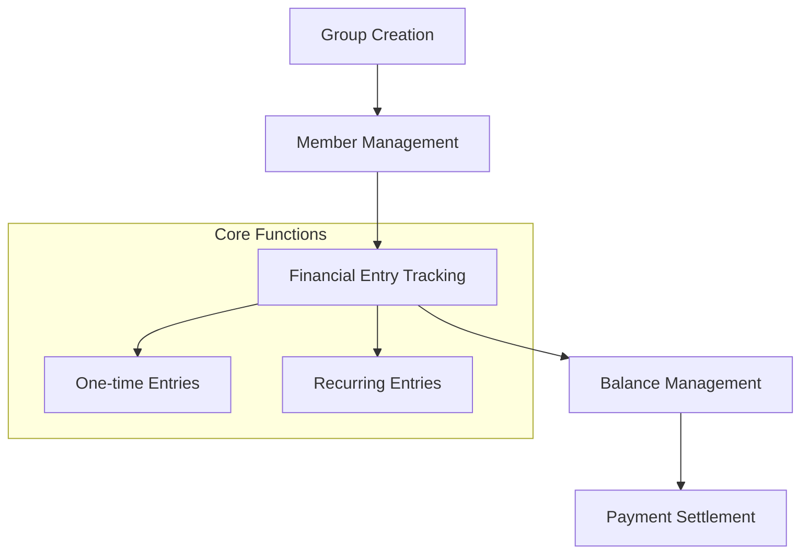

# Band Robust Framework: Music Group Financial Management

The Band Robust Framework is a cutting-edge, blockchain-powered solution designed to revolutionize financial collaboration for music groups, bands, and creative collectives. By leveraging the Stacks blockchain's smart contract capabilities, we provide a transparent, secure, and efficient platform for managing shared finances.

## Overview

Modern music groups face complex financial challenges: tracking expenses, allocating income, managing royalties, and maintaining financial transparency. The Band Robust Framework solves these challenges by offering:

- Decentralized financial tracking
- Transparent expense and income management
- Flexible allocation mechanisms
- Secure payment settlements
- Immutable financial records

## Key Features

🎵 **Group Financial Management**
- Create and manage band/group financial profiles
- Add and manage group members
- Set custom financial allocations

💰 **Expense and Income Tracking**
- Record one-time and recurring financial entries
- Support for various entry types (expenses, income, royalties)
- Equal and custom allocation strategies

🤝 **Transparent Settlements**
- Track running balances between members
- Facilitate direct payment settlements
- Maintain an immutable transaction history

## Architecture



## Getting Started

### Prerequisites
- Stacks wallet
- Basic understanding of blockchain concepts

### Installation
1. Clone the repository
2. Install dependencies: `clarinet install`
3. Deploy contract: `clarinet deploy`

### Basic Usage

1. Create a band group:
```clarity
(contract-call? .band-shared-financials create-group "Awesome Band")
```

2. Add band members:
```clarity
(contract-call? .band-shared-financials add-member group-id member-address)
```

3. Record a financial entry:
```clarity
;; Record an income entry with equal allocation
(contract-call? .band-shared-financials record-financial-entry 
  group-id 
  "Spotify Royalties" 
  u1000 
  tx-sender 
  "income" 
  u0 
  "equal"
)
```

## Function Reference

### Group Management
```clarity
(create-group (name (string-ascii 100)))
(add-member (group-id uint) (new-member principal))
(update-member-allocation (group-id uint) (member principal) (allocation-bps uint))
```

### Financial Entry Management
```clarity
(record-financial-entry 
  (group-id uint) 
  (name (string-ascii 100)) 
  (amount uint) 
  (paid-by principal) 
  (entry-type (string-ascii 20)) 
  (recurrence-period uint) 
  (allocation-type (string-ascii 10))
)
```

### Payment Settlement
```clarity
(settle-payment (group-id uint) (to-member principal) (amount uint))
```

## Security Considerations

- Maximum 20 members per group
- Strict access controls
- Transparent allocation mechanisms
- Immutable financial records

### Best Practices
- Verify group member balances before settlements
- Set accurate financial entry allocations
- Double-check payment amounts
- Keep detailed financial records

## Development

### Testing
1. Run tests: `clarinet test`
2. Local development: `clarinet console`

## Contributing

We welcome contributions! Please see our contributing guidelines for more details.

## License

[Insert appropriate open-source license]

## Disclaimer

Use at your own risk. Always verify financial transactions and consult with financial professionals.